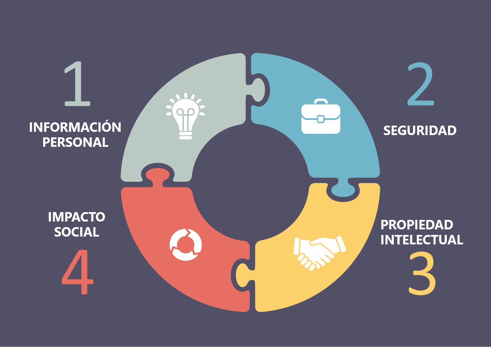

---

class: center, middle, remark-inverse

# 1. Introducción 

---
class: middle, center

# Casos notorios de dilemas éticos asociados a sistemas de información

.pull-left[ 

```{r echo=FALSE, message=FALSE, warning=FALSE, out.width="90%"}


```

]

.pull-right[

## - Caso Facebook - Cambrige Analytica</b>

[más info](https://elpais.com/tag/caso_cambridge_analytica/a)

]

---

# Casos notorios de dilemas éticos asociados a sistemas de información (II)

.pull-left[ 

```{r echo=FALSE, message=FALSE, warning=FALSE, out.width="90%"}


```

]

.pull-right[

## - Caso YouTube y contenidos extremos</b>

[más info](https://www.nytimes.com/2019/06/03/world/americas/youtube-pedophiles.html)

]


---


# Casos notorios de dilemas éticos asociados a sistemas de información (III)

.pull-left[ 

```{r echo=FALSE, message=FALSE, warning=FALSE, out.width="90%"}


```

]

.pull-right[

## - Caso Bono social en China

[más info](https://www.wired.com/story/china-social-credit-score-system/)

]


---

# Áreas especialmente sensibles

```{r echo=FALSE, message=FALSE, warning=FALSE, out.width="80%"}



```
