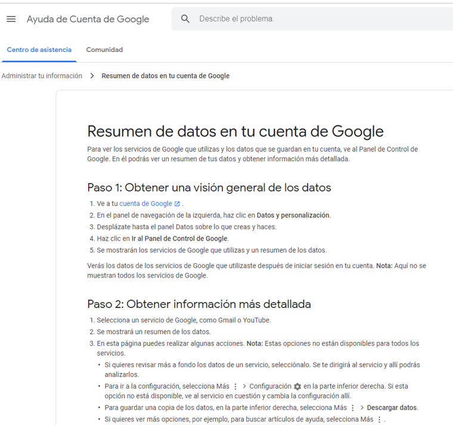
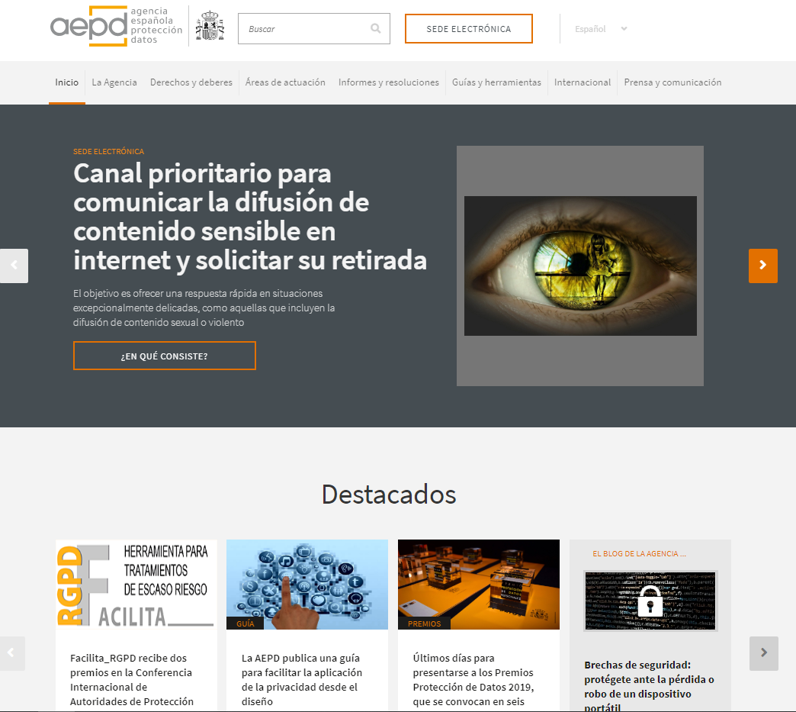
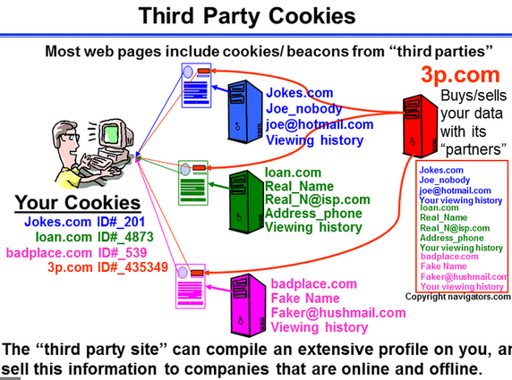

class: center, middle, remark-inverse

# 2. Datos personales y privacidad 

---
class: middle, center

# Privacidad vs Valor de Datos personales

.pull-left[ 

<em>"Los datos son el nuevo oro"</em>

]

.pull-right[

<em>"Cuando el producto es gratis, el producto eres tú."</em>

]

---
# Los datos personales permiten individualizar

### Diseñar mejores productos, publicidad personalizada, conjuntos de elección distintos

```{r echo=FALSE, message=FALSE, warning=FALSE, out.width="90%"}


```

---
class: middle, center

## También generan riesgos y preocupación para los usuarios

```{r echo=FALSE, message=FALSE, warning=FALSE, out.width="90%"}


```

---

# El papel de las AAPP en este conflicto

## Papel más activo del legislador en Europa que en EEUU

- En España LOPD (1999) crea la Agencia Española de Protección de Datos

## En 2018 Europa aprueba **G**eneral **D**ata **Protection** **Regulation**

- son datos personales toda información sobre una persona física identificada o **identificable** (el interesado).

- persona física identificable es toda aquella persona cuya identidad pueda **determinarse** directa o **indirectamente**.

---

# Datos especialmente protegidos en la GDPR

.pull-left[
- Origen étnico o racial  
- Opiniones políticas  
- Convicciones religiosas  
- Afiliación sindical  
- Datos genéticos y biométricos  
- Datos de salud y vida sexual  
- Orientación sexual  
]

.pull-right[

```{r echo=FALSE, message=FALSE, warning=FALSE, out.width="90%"}

knitr::include_graphics("images/data.jpg")

```
]

---

# Aspectos más relevantes


.pull-left[

```{r echo=FALSE, message=FALSE, warning=FALSE, out.width="90%"}



```

]

.pull-right[

- Notificación de brechas obligatoria en 72h
- Privacidad desde el diseño y privacidad por defecto
- Evaluación de impacto obligatoria
- Delegado de protección de datos
- Sanciones
- Derechos ciudadanos: 
    - Derecho al olvido
    - Derecho a la portabilidad de los datos
    - Derecho de oposición a la creación de perfiles
- Modelo "opt-in" vs modelo "opt-out"    
]

---

# La Agencia Española de Protección de Datos


.pull-left[

```{r echo=FALSE, message=FALSE, warning=FALSE, out.width="90%"}


```

https://www.aepd.es/

]

.pull-right[

### - Encargada de supervisar la aplicación de la ley

### - Otros servicios

- Difusión de derechos y deberes: acceso, rectificación, oposición, supresión (olvido), portabilidad...

- Servicios a empresas: Asesoría en la aplicación: Programa Facilita 2.0

]

---

# La privacidad y las cookies

.pull-left[

### - Cookies técnicas

### - Cookies de personalización

### - Cookies de análisis

### - Cookies de terceros

### Los sistemas VPN (redes privadas virtuales)

]

.pull-right[

```{r echo=FALSE, message=FALSE, warning=FALSE, out.width="90%"}



```

]

