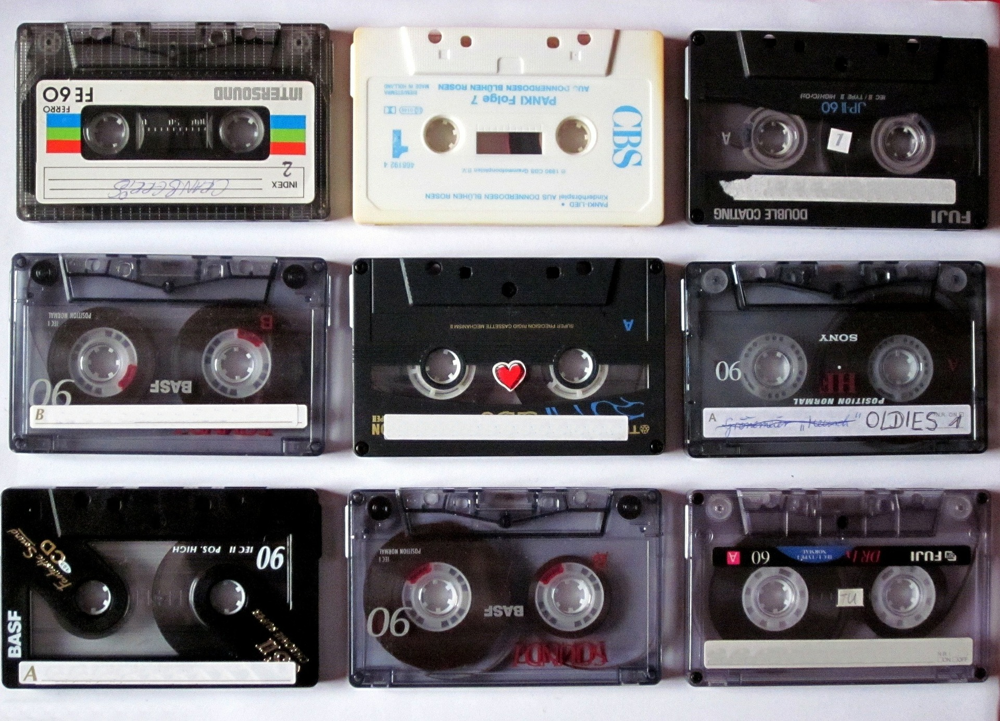

class: center, middle, remark-inverse

# 4. Derechos y obligaciones de propiedad: Propiedad intelectual


---
# Información digital


.pull-left[

## Altos costes de producción, bajos costes de reproducción
]


.pull-right[

```{r echo=FALSE, message=FALSE, warning=FALSE, out.width="90%"}


```

]

---
# Tipos de protección

### - Secreto comercial

### - Derechos de autor

### - Propiedad Industrial

---
# Secreto comercial

.pull-left[


- Información confidencial en las relaciones profesionales

- Legislación sobre defensa de la competencia afecta sobre todo a los empleados

- Responsabilidad también si se recogen claúsulas de confidencialidad

]

.pull-right[

```{r echo=FALSE, message=FALSE, warning=FALSE, out.width="90%"}

knitr::include_graphics("images/code.jpg")
```

]

---
# Derechos de autor

.pull-left[

- Derechos morales y de explotación por las creaciones propias
- Legislación y jurisprudencia compleja

]

.pull-right[

```{r echo=FALSE, message=FALSE, warning=FALSE, out.width="90%"}


```

[artículo en Xataka](https://www.xataka.com/legislacion-y-derechos/caso-euskaltel-se-extiende-toda-espana-amenazas-carta-pidiendo-dinero-para-evitar-ir-a-juicio-descargas-p2p)
]