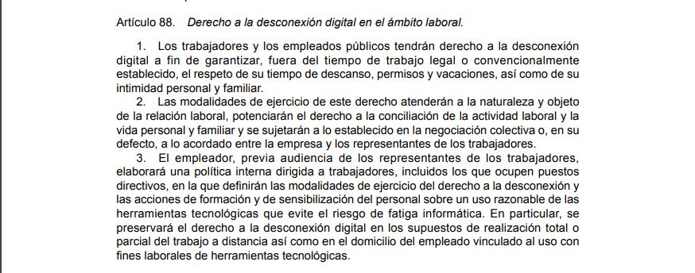

class: center, middle, remark-inverse

# 5. Impacto social y calidad de vida


---

# Otras áreas importantes

### - Balance de poder consumidores/empresas/plataformas
### - Velocidad del cambio y necesidad de adaptación continua, con aparición de la brecha digital
### - La existencia de límites cada día más difusos entre la vida familiar/profesional
### - Dependencia y vulnerabilidad de los sistemas
### - El impacto en empleo con los cambios en las demandas profesionales

---

# Balance de poder consumidores/empresas/plataformas

```{r echo=FALSE, message=FALSE, warning=FALSE, out.width="90%"}


```

[Ejemplo INE](https://www.eleconomista.es/economia/noticias/10167522/10/19/El-INE-usara-los-movimientos-de-nuestros-telefonos-moviles-para-elaborar-un-nuevo-estudio.html)

---

# Velocidad del cambio y necesidad de adaptación continua

.pull-left[


### - Aparición de la brecha digital: ¿qué sucede con los que no pueden adaptarse?

]


.pull-right[


```{r echo=FALSE, message=FALSE, warning=FALSE, out.width="90%"}


```


<a href="https://www.lavanguardia.com/vida/junior-report/20190509/462140060359/brecha-digital-desigualdad-acceso-internet.html" target="_blank">la vanguardia</a>

]

---

# Límites difusos entre vida familiar/profesional

### - Derecho a la desconexión digital - LOPD

```{r echo=FALSE, message=FALSE, warning=FALSE, out.width="90%"}


```

---
class: center

# Dependencia y vulnerabilidad de los sistemas

Ejemplo: [Apagón Tenerife](https://elpais.com/politica/2019/09/29/actualidad/1569764208_489586.html)

```{r echo=FALSE, message=FALSE, warning=FALSE, out.width="50%"}


```

---

# Impacto en empleo. Ejemplos:

.pull-left[

- Controlador de tráfico con drones
- Diseñadores de impresión 3D en moda
- Analista de autotransporte
- Contextualistas de datos
- Cosechadores de agua
- Especialistas en avatares
- Terapeutas y cirujanos de aumento de memoria

[Randstad](https://www.randstad.es/tendencias360/como-sera-el-futuro-del-empleo-en-2030/)

]
.pull-right[


```{r echo=FALSE, message=FALSE, warning=FALSE, out.width="90%"}


```
]
